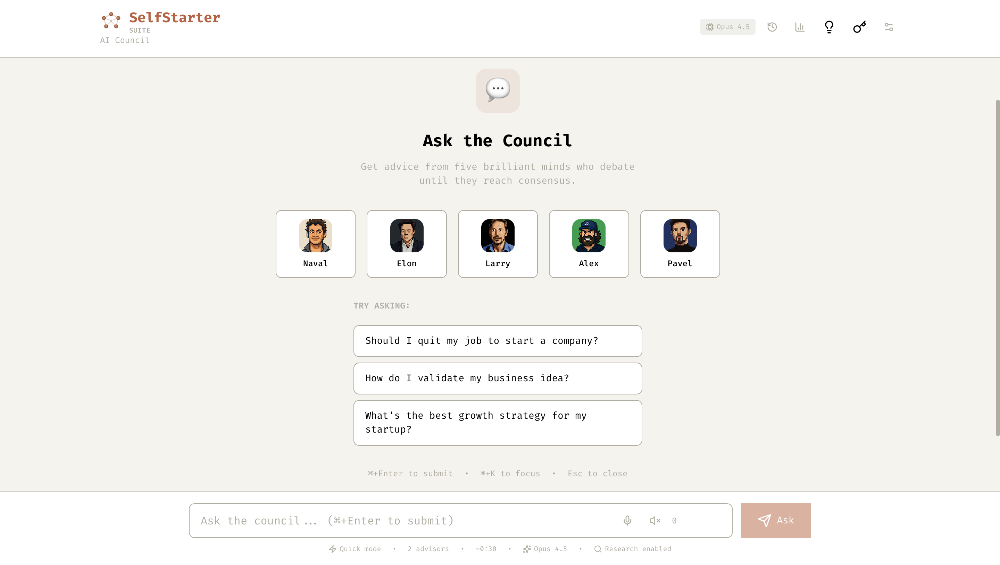

# StartupCouncilAI

<div align="center">

[](https://vercel.com/new/clone?repository-url=https://github.com/Grandillionaire/StartupCouncilAI)
[](./DEPLOYMENT.md)
[](https://console.anthropic.com)
[](https://opensource.org/licenses/MIT)

</div>

> **⚠️ THIS IS A TEMPLATE - DEPLOY YOUR OWN INSTANCE**
>
> This is an **open-source template**. Each person deploys their **own private instance** to Vercel (free).
>
> **No shared service** - Everyone gets their own private URL that works on all their devices.
>
> 👉 **[Deploy Your Own](#deployment)** | Takes 2 minutes | Free forever

---

An AI-powered council platform where five legendary advisors debate your questions until they reach consensus. Built with Next.js 15 and TypeScript.

**🚀 How It Works:**

- ✅ Fork/clone this template repository
- ✅ Deploy to Vercel = Get your **own private URL**
- ✅ Access from **all your devices** (phone, tablet, desktop)
- ✅ Enter API keys in browser (stays local, never uploaded)
- ✅ **100% private** - No one else can access your instance

## Overview

StartupCouncilAI provides access to an AI council featuring Naval Ravikant, Elon Musk, Larry Ellison, Alex Hormozi, and Pavel Durov. Ask any question and watch as these advisors debate in real-time, bringing their unique perspectives to help you make better decisions.

**Key Points:**
- ✅ Free to deploy your own instance
- ✅ You control your data and API keys
- ✅ Enterprise-grade security built-in
- ✅ No backend infrastructure needed

## Demo

<p align="center">
  
</p>

*Live debate interface with real-time advisor responses and consensus building*

## Key Features

**Multi-Agent Debate System**
- Five specialized AI advisors with distinct personalities and expertise
- Sequential debate rounds with real-time consensus detection
- Live visualization showing debate progress and advisor status

**Voice Integration**
- Voice input using Web Speech API for hands-free questions
- Text-to-speech output to hear the final consensus
- Mobile-friendly voice-first experience

**Cost Optimization**
- 90% API cost reduction through prompt caching
- Efficient token usage with intelligent context management
- Sustainable for high-volume usage

**Smart Templates**
- 16 pre-built question templates across 7 categories
- Business, Career, Product, Research, Finance, Personal, and Quick decisions
- Auto-configured debate settings per template

**Professional Export**
- PDF export with formatted debate transcripts
- Markdown export for developer workflows
- Share links for collaborative decision-making

**Power User Features**
- Comprehensive keyboard shortcuts for all actions
- Real-time debate visualization
- Conversation history with search and filtering
- Browser-based API key management

## Deployment

### 🚀 Deploy Your Own Private Instance

**IMPORTANT:** This creates YOUR OWN private app that only you can access. Perfect for using on your phone, tablet, and computer.

#### 1️⃣ Get an Anthropic API Key (Required)
```
1. Go to https://console.anthropic.com
2. Sign up / Log in
3. Click "Get API Keys"
4. Create a new key
5. Copy it (starts with "sk-ant-")
```
💰 **Cost:** ~$0.03 per debate | Free $5 credit to start

#### 2️⃣ Deploy to Vercel (1-Click, Free Forever)

Click this button → Sign in with GitHub → Click "Deploy":

[](https://vercel.com/new/clone?repository-url=https://github.com/Grandillionaire/StartupCouncilAI)

**What happens:**

- ✅ Vercel creates YOUR copy in YOUR GitHub account
- ✅ Builds and deploys YOUR private instance
- ✅ Gives YOU a unique URL like: `https://[your-project-name].vercel.app`
- ✅ **Takes 60 seconds**, then YOUR app is live!

**You get:**

- ✅ **Your own private app** (like having your own ChatGPT)
- ✅ Works on all YOUR devices (phone, tablet, computer)
- ✅ No one else can see or use it
- ✅ Free hosting forever (Vercel free tier)
- ✅ YOUR API keys stay in YOUR browser

#### 3️⃣ Add Your API Key (In YOUR Browser)

```
1. Open YOUR unique Vercel URL
2. Click the Key icon (🔑) or Settings (⚙️)
3. Paste your Anthropic API key
4. Click Save (stored locally in YOUR browser only)
```

#### 4️⃣ Start Using It!
```
1. Ask your first question
2. Watch the AI advisors debate
3. Get consensus answer
```

**That's it!** Your personal AI council is running. 🎉

---

### 📚 Detailed Guides

- **[Full Deployment Guide](./DEPLOYMENT.md)** - Security, monitoring, costs, troubleshooting
- **[Architecture Decision](./ARCHITECTURE_DECISION.md)** - Why this deployment model
- **[Security Documentation](./SECURITY.md)** - Security features and best practices

---

### ❓ Frequently Asked Questions

**Q: Is there a website I can visit to use this?**
A: ❌ No! There is no hosted version. You must deploy your own instance first (takes 2 minutes, free).

**Q: Do you host this for me?**
A: ❌ No. Each user deploys their own private instance to their own Vercel account.

**Q: Who pays for the AI?**
A: You do, directly to Anthropic. You bring your own API key (~$0.03 per debate, $5 free credit to start).

**Q: Can I use this without deploying?**
A: ❌ No. This is self-hosted software, not a web service.

**Q: Is the hosting really free forever?**
A: ✅ Yes! Vercel's free tier is generous and permanent. You only pay for API usage.

**Q: Do I need to know how to code?**
A: ✅ No! Just click the "Deploy to Vercel" button and follow the 4 steps. No coding required.

**Q: What about my data privacy?**
A: ✅ All data stays in YOUR browser's localStorage. Nothing is sent to our servers (we don't have any!).

**Q: Can other people use my deployed instance?**
A: ⚠️ Your Vercel URL is public, but rate limiting prevents abuse. Keep your URL private if you prefer.

---

### 🛠️ Local Development

For development or testing locally:

#### Prerequisites
- Node.js 18 or later
- npm or yarn
- Anthropic API key ([Get one here](https://console.anthropic.com))
- Tavily API key - optional ([Get one here](https://tavily.com))

#### Installation

```bash
# Clone the repository
git clone https://github.com/Grandillionaire/SelfStarterSuite.git
cd SelfStarterSuite

# Install dependencies
npm install

# Run development server
npm run dev
```

Open [http://localhost:3000](http://localhost:3000) in your browser.

#### Configuration

On first run, you'll be prompted to enter your Anthropic API key.

For research features, add your Tavily API key in Settings.

**Security Note:** API keys are stored in your browser's localStorage and never sent to external servers (except Anthropic/Tavily APIs).

## Architecture

### Tech Stack
- **Frontend**: Next.js 15 (App Router), React 19, TypeScript
- **State Management**: Zustand
- **Styling**: TailwindCSS with custom design system
- **AI**: Anthropic Claude 4.5 (Opus, Sonnet, Haiku)
- **Research**: Tavily Search API
- **Voice**: Web Speech API (browser-native)

### Project Structure
```
SelfStarterSuite/
├── app/                    # Next.js app router
│   ├── api/               # API routes
│   └── globals.css        # Global styles
├── components/            # React components
│   ├── CouncilChat.tsx   # Main chat interface
│   ├── DebateVisualizer.tsx
│   └── ...
├── lib/
│   ├── agents/           # Advisor personas and logic
│   ├── stores/           # Zustand state management
│   └── utils/            # Utilities and helpers
└── public/               # Static assets
```

## Usage

### Starting a Debate

1. Enter your question in the input field
2. Optionally select debate mode (Quick, Standard, Deep)
3. Choose which advisors to include
4. Press Enter or click Submit
5. Watch the debate unfold in real-time

### Keyboard Shortcuts

- `Cmd/Ctrl + Enter` - Submit question or interrupt debate
- `Cmd/Ctrl + K` - Focus input field
- `Cmd/Ctrl + V` - Toggle voice input
- `Cmd/Ctrl + R` - Regenerate last answer
- `Cmd/Ctrl + D` - Download as Markdown
- `Cmd/Ctrl + Shift + D` - Export as PDF
- `Cmd/Ctrl + T` - Open templates
- `Cmd/Ctrl + H` - Toggle history
- `Cmd/Ctrl + A` - Toggle analytics
- `Cmd/Ctrl + /` - Show all shortcuts
- `Esc` - Close any modal

## The Advisors

**Naval Ravikant** - Philosopher and Angel Investor
Focus on leverage, specific knowledge, and long-term thinking

**Elon Musk** - Entrepreneur and Engineer
Engineering-minded, data-driven, rapid iteration approach

**Larry Ellison** - Enterprise Tech Titan
Competitive strategy, market dominance, business moats

**Alex Hormozi** - Business Scaling Expert
Practical tactics, frameworks, and actionable metrics

**Pavel Durov** - Privacy and Tech Visionary
Principled, minimalist, authentic growth strategies

## Development

### Build for Production

```bash
npm run build
npm start
```

### Environment Variables

Create a `.env.local` file (optional, for development):

```
ANTHROPIC_API_KEY=your_key_here
TAVILY_API_KEY=your_key_here
```

Note: Users can enter keys directly in the UI, so environment variables are optional.

## Contributing

Contributions are welcome. Please follow these guidelines:

1. Fork the repository
2. Create a feature branch (`git checkout -b feature/amazing-feature`)
3. Commit your changes (`git commit -m 'Add amazing feature'`)
4. Push to the branch (`git push origin feature/amazing-feature`)
5. Open a Pull Request

Ensure all builds pass (`npm run build`) before submitting.

## License

MIT License - see LICENSE file for details

## Acknowledgments

Inspired by multi-agent debate research and the wisdom of legendary entrepreneurs and thinkers.

## Support

For issues and feature requests, please use the GitHub issue tracker.

## Roadmap

- Custom advisor creation
- Team collaboration mode
- Batch processing for multiple questions
- Mobile native apps
- Extended analytics and insights
- API access for developers
